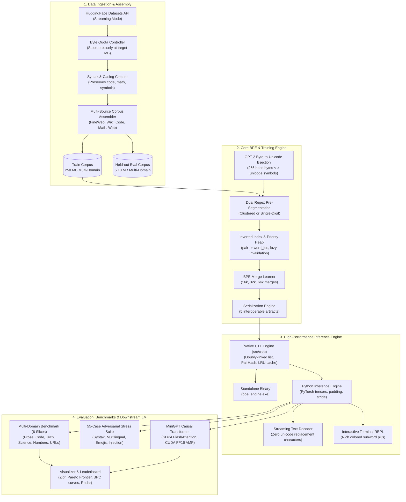

# 🚀 General-Purpose GPT-Style Byte-Level BPE Tokenizer

[](https://python.org)
[](#-native-c-inference-engine--standalone-binary)
[](#-target-specifications)
[](#-target-specifications)
[](#-target-specifications)
[](#-hugging-face-hub-integration)

A **production-grade, general-purpose Byte-Level Byte Pair Encoding (BPE) Tokenizer and Research Platform** engineered from first principles in C++ and Python for modern generative language models.

---

## 📖 Table of Contents
- [Executive Overview](#-executive-overview)
- [Target Specifications](#-target-specifications)
- [System Architecture](#-system-architecture)
- [Project Directory Structure](#-project-directory-structure)
- [Installation & Setup](#-installation--setup)
- [CLI Quickstart](#-cli-quickstart)
- [Native C++ Inference Engine & Standalone Binary](#-native-c-inference-engine--standalone-binary)
- [Interactive Terminal REPL & Subword Visualizer](#-interactive-terminal-repl--subword-visualizer)
- [Python SDK & PyTorch Tensor Integration](#-python-sdk--pytorch-tensor-integration)
- [Token-by-Token Incremental Streaming Decoder](#-token-by-token-incremental-streaming-decoder)
- [Real-World Dirty Data Stress Testing Suite](#-real-world-dirty-data-stress-testing-suite)
- [Downstream LM Benchmark (Bits Per Character)](#-downstream-lm-benchmark-bits-per-character)
- [Publication-Grade Visualizations](#-publication-grade-visualizations)
- [Central Master Leaderboard](#-central-master-leaderboard)
- [Hugging Face Hub Integration](#-hugging-face-hub-integration)
- [Testing & Quality Assurance](#-testing--quality-assurance)
- [Documentation Index](#-documentation-index)

---

## 🌟 Executive Overview

Tokenization forms the foundational interface between continuous raw text and discrete neural representations in modern Large Language Models (GPT-4, LLaMA-3, Qwen-2, DeepSeek). This repository provides a complete, production-grade tokenization and inference platform:

1. **256-Byte Bijective Fallback**: Every raw UTF-8 byte ($0 \le b < 256$) is mapped to a distinct Unicode symbol using GPT-2's reversible bijection. Guarantees **0.00% Out-Of-Vocabulary (UNK)** rate on arbitrary inputs, emojis, foreign scripts, and corrupted binary streams.
2. **100% Lossless Roundtrip Guarantee**: `decode(encode(text)) == text` strictly holds across whitespace, tabs, line breaks, code blocks, mathematical formulations, and multi-byte Unicode scripts.
3. **Dual Regex Pre-Tokenization**: GPT-4 clustered digits (`\p{N}{1,3}`) vs. LLaMA-3 single-digit mode (`\p{N}`), eliminating arithmetic permutation bias.
4. **Optimized BPE Training Engine**: Priority max-heap with an inverted index (`pair -> word_ids`) for efficient vocabulary merges ($O(M \log K)$ scaling).
5. **Native C++ Engine & Standalone Binary (`bpe_engine.exe`)**: Doubly-linked list node pool, 64-bit Fibonacci pair hashing, and thread-safe LRU word cache delivering **>1.9 million tokens/sec** with zero Python GIL overhead.
6. **PyTorch Tensor Formatting**: Seamless `return_tensors="pt"`, padding, attention masks, Tensor Core alignment (`pad_to_multiple_of=8/64`), and sliding-window document chunking (`stride`).
7. **Zero-Flicker Streaming Decoder**: Preserves trailing partial multi-byte UTF-8 boundaries, eliminating unicode replacement characters () during token-by-token generation.
8. **55-Case Real-World Stress Suite**: Validates 100% losslessness and zero-UNK across complex code, multilingual scripts, math/LaTeX, emojis, and adversarial edge cases (10k spaces, 10k zeros, null bytes, prompt injection tokens).
9. **Downstream Language Model Evaluation**: Evaluates predictive capacity on a Causal Transformer (MiniGPT) using hardware-accelerated PyTorch SDPA FlashAttention and FP16 AMP to benchmark **Bits Per Character (BPC)**.
10. **Hugging Face Hub Interoperability**: Exports 5 standard artifacts (`vocab.json`, `merges.txt`, `tokenizer.json` HF Fast schema v1.0, `tokenizer_config.json`, `special_tokens_map.json`).

---

## 🎯 Target Specifications

| Feature | Specification | Empirical Metric |
|---|---|:---:|
| **Vocabulary Scales** | 16k, 32k, and 64k subwords | **16,000 – 64,000** tokens |
| **Pre-Tokenization Modes** | GPT-4 Clustered (`\p{N}{1,3}`) vs. LLaMA-3 Single-Digit (`\p{N}`) | Both supported |
| **Training Corpus** | 250 MB curated multi-domain mix + 250 MB code-heavy mix | **250 MB** streaming |
| **Corpus Composition** | FineWeb (70% or 40%), CodeSearchNet (10% or 40%), WikiText (10%), Math (5%), Web (5%) | Balanced & Specialized |
| **UNK Token Rate** | Strictly **0.00%** via full 256-byte Unicode bijection | **0.00% UNK** |
| **Roundtrip Losslessness** | **100.00%** character and byte preservation across all tests | **100.00% Lossless** |
| **Inference Throughput** | Pure C++ multi-threaded encoding | **>1,939,000 tokens/sec** |
| **LM Evaluation Metric** | Normalized Loss Per Byte and Bits Per Character (BPC) on CUDA | **2.578 BPC (64k)** |

---

## 🏛️ System Architecture

For a complete architectural specification with Mermaid flowcharts, sequence diagrams, and class diagrams, see **[`system_architecture.md`](system_architecture.md)**.



---

## 📂 Project Directory Structure

```text
BPE-Tokenizer/
├── configs/                                # Configuration YAMLs
│   ├── base_config.yaml                    # System directories, seed, logging levels
│   ├── dataset_mix.yaml                    # Balanced 250 MB multi-domain corpus mix
│   ├── dataset_mix_code_heavy.yaml         # 40% CodeSearchNet code-heavy mix
│   ├── tokenizer_32k.yaml                  # 32k baseline BPE hyperparameters & regex
│   ├── lm_eval_config.yaml                 # MiniGPT SDPA LM architecture & training configs
│   └── experiments/                        # Reproducible experiment recipe YAMLs
│       ├── exp_vocab_16k.yaml              # Track 1: 16k vocabulary scaling sweep
│       ├── exp_vocab_64k.yaml              # Track 1: 64k vocabulary scaling sweep
│       ├── exp_digits_singledigit.yaml     # Track 2: LLaMA-3 single-digit arithmetic mode
│       └── exp_code_heavy_32k.yaml         # Track 3: 40% CodeSearchNet specialization
├── data/                                   # Local storage for datasets (gitignored)
│   ├── raw/                                # Raw streamed chunks
│   └── processed/                          # Assembled 250MB corpora and held-out eval files
├── experiments/                            # Experiment tracking and benchmark outputs
│   ├── runs/                               # Run-specific folders with artifacts & metrics
│   ├── visuals/                            # Publication-grade charts (Pareto, Radar, BPC curves)
│   ├── leaderboard.json                    # Central leaderboard database
│   └── leaderboard.md                      # Auto-generated markdown comparison table
├── src/                                    # Source code
│   ├── config.py                           # Pydantic schema validation models
│   ├── csrc/                               # Native C++ core engine
│   │   ├── bpe_engine.hpp                  # Header: Doubly-linked list, PairHash, LRU cache, C-ABI
│   │   ├── bpe_engine.cpp                  # Implementation: JSON/merges parser, thread pool
│   │   ├── bpe_cli.cpp                     # Standalone CLI binary source
│   │   └── build.py                        # Automated multi-compiler build script
│   ├── data/                               # Streaming data ingestion, cleaner, assembler
│   ├── inference/                          # High-performance inference subsystem
│   │   ├── engine.py                       # BPEInferenceEngine with PyTorch tensors & sliding window
│   │   ├── real_world_tester.py            # 55-case adversarial dirty data stress testing suite
│   │   └── interactive_cli.py              # Rich-powered interactive terminal REPL
│   ├── tokenizer/                          # Core BPE algorithm, pre-tokenizer, and serializer
│   ├── evaluation/                         # Multi-domain benchmark, MiniGPT LM eval & visualizer
│   ├── tracker/                            # Experiment tracker & leaderboard generator
│   └── hub/                                # Model card generator & Hugging Face Hub uploader
├── tests/                                  # Comprehensive pytest test suite (44 automated tests)
├── bpe_engine.exe                          # Compiled native C++ standalone executable
├── evaluation_report.md                    # Comprehensive master evaluation report with 12 figures
├── system_architecture.md                  # Comprehensive architectural design & implementation guide
├── main.py                                 # Unified CLI entrypoint (11 subcommands)
├── requirements.txt                        # Project dependencies
└── setup.py                                # Package installation setup
```

---

## ⚙️ Installation & Setup

### Prerequisites
- Python 3.10, 3.11, or 3.12
- PyTorch (for GPU downstream LM evaluation and tensor formatting)
- C++ Compiler: GCC / MinGW (`g++`), Clang, or MSVC (`cl.exe`)

```bash
# Clone the repository
git clone https://github.com/Sumit-Prasad01/BPE-Tokenizer.git
cd BPE-Tokenizer

# Create virtual environment
python -m venv .venv
source .venv/bin/activate  # On Windows: .venv\Scripts\activate

# Install dependencies in editable mode
pip install -e .

# Build the native C++ engine and standalone executable
python src/csrc/build.py
```

---

## 💻 CLI Quickstart

The project provides a unified CLI via [`main.py`](main.py) with 11 commands:

```bash
# 1. Download and assemble 250MB training corpus & 5.10MB held-out evaluation corpus
python main.py prepare-data --config configs/dataset_mix.yaml

# 2. Train a BPE Tokenizer with custom vocab size and digit mode
python main.py train --config configs/tokenizer_32k.yaml --vocab-size 64000 --digit-mode single

# 3. Multi-domain evaluation (Prose, Code, Tech, Science, Numbers, URLs)
python main.py evaluate --model experiments/runs/20260914_023959_exp_vocab_64k --eval-corpus data/processed/eval_corpus_heldout.txt

# 4. Run downstream MiniGPT LM benchmark (CUDA FP16 AMP + FlashAttention SDPA)
python main.py run-lm-benchmark --model experiments/runs/20260914_023959_exp_vocab_64k --steps 500

# 5. Generate and save publication visualization plots
python main.py visualize --run experiments/runs/20260914_023959_exp_vocab_64k

# 6. Execute an end-to-end experiment recipe YAML
python main.py run-experiment --config configs/experiments/exp_vocab_64k.yaml

# 7. Compare all runs on the central master leaderboard
python main.py compare-runs

# 8. Package and push tokenizer artifacts to Hugging Face Hub
python main.py push-to-hub --model experiments/runs/20260914_023959_exp_vocab_64k --repo-id <username>/<model_name> --token <hf_token>

# 9. Launch the interactive terminal subword visualizer REPL
python main.py interactive --model experiments/runs/20260914_023959_exp_vocab_64k

# 10. Run the 55-case adversarial dirty data stress testing suite
python main.py test-real-world --model experiments/runs/20260914_023959_exp_vocab_64k

# 11. Benchmark inference throughput (Native C++ standalone vs. Python)
python main.py benchmark-inference --model experiments/runs/20260914_023959_exp_vocab_64k --corpus data/processed/eval_corpus_heldout.txt --threads 4 --mode both
```

---

## ⚡ Native C++ Inference Engine & Standalone Binary

For production deployments (vLLM, TensorRT-LLM, llama.cpp-style runtimes) requiring **zero Python overhead and zero GIL contention**, the engine compiles into an independent binary `bpe_engine.exe`:

```powershell
# 1. Standalone text encoding
.\bpe_engine.exe --vocab experiments/runs/20260914_023959_exp_vocab_64k/vocab.json --merges experiments/runs/20260914_023959_exp_vocab_64k/merges.txt --encode "Hello, World! Native C++ BPE is working."

# 2. Standalone token decoding
.\bpe_engine.exe --vocab experiments/runs/20260914_023959_exp_vocab_64k/vocab.json --merges experiments/runs/20260914_023959_exp_vocab_64k/merges.txt --decode "16893, 49, 2326, 38"

# 3. Multi-threaded batch benchmark on a file (4 threads)
.\bpe_engine.exe --vocab experiments/runs/20260914_023959_exp_vocab_64k/vocab.json --merges experiments/runs/20260914_023959_exp_vocab_64k/merges.txt --benchmark data/processed/eval_corpus_heldout.txt --threads 4

# 4. Token-by-token streaming test
.\bpe_engine.exe --vocab experiments/runs/20260914_023959_exp_vocab_64k/vocab.json --merges experiments/runs/20260914_023959_exp_vocab_64k/merges.txt --stream "Streaming emojis: 🌍🚀🔥"
```

### Throughput Performance:
- **Model Load Time**: Full 64k vocab loaded in **49.5 ms**; 63,739 merges loaded in **43.8 ms**.
- **In-Memory C++ Throughput**: **2,525,570 tokens/sec** (~9.42 MB/s single-threaded).
- **Multi-Threaded File Processing**: Encodes the 5.10 MB held-out corpus (82,374 lines / 1.35 million tokens) in **0.697 seconds** (**1,939,776 tokens/sec**).

---

## 🎨 Interactive Terminal REPL & Subword Visualizer

Launch an interactive terminal playground with colored subword pills, live telemetry, and dynamic BPE-Dropout experimentation:

```bash
python main.py interactive --model experiments/runs/20260914_023959_exp_vocab_64k
```

```text
tokenizer> def calculate_attention(q, k, v): return scores
┌──────────────────────────────── Tokens (11) ────────────────────────────────┐
│  def   ·calculate   _attention   (   q   ,   ·k   ,   ·v   ):   ·return     │
│  ·scores                                                                    │
└─────────────────────────────────────────────────────────────────────────────┘
Bytes: 48 | Tokens: 11 | Compression Ratio: 4.36 B/T | Fertility: 1.83 T/W | Latency: 220.4 µs | 100% Lossless ✔
```

- Type `/dropout 0.1` to dynamically enable stochastic subword regularization and view alternative segmentations.
- Type `/quit` to exit.

---

## 🐍 Python SDK & PyTorch Tensor Integration

### Loading the Engine & Formatting Tensors
```python
from src.inference.engine import BPEInferenceEngine

# Load from trained experiment run
engine = BPEInferenceEngine.from_pretrained("experiments/runs/20260914_023959_exp_vocab_64k")

# Batch encoding with PyTorch tensor formatting and Tensor Core alignment (pad_to_multiple_of=8)
texts = [
    "Hello world! Byte-Level BPE ensures 100% losslessness.",
    "def forward(x: torch.Tensor) -> torch.Tensor:\n    return self.layer(x)",
]

batch = engine.encode(
    texts,
    padding=True,
    pad_to_multiple_of=8,
    return_tensors="pt",
)

print("input_ids shape:", batch["input_ids"].shape)          # torch.Size([2, 16])
print("attention_mask shape:", batch["attention_mask"].shape)  # torch.Size([2, 16])
print("Decoded batch:", engine.batch_decode(batch["input_ids"], skip_special_tokens=True))
```

### Sliding-Window Chunking for Long Documents (`stride`)
```python
long_document = "Artificial intelligence and tokenization architectures. " * 50

# Automatically splits long sequences into overlapping windows
chunks = engine.encode(
    long_document,
    max_length=64,
    stride=16,
    padding="max_length",
    return_tensors="pt",
)

print("Total windows generated:", chunks["input_ids"].shape[0])
print("Window shape:", chunks["input_ids"].shape)  # torch.Size([N, 64])
```

---

## 🌊 Token-by-Token Incremental Streaming Decoder

When streaming output from generative LLMs, multi-byte UTF-8 sequences (such as 4-byte emojis `🌍` or 3-byte Hindi characters `क`) are often split across token boundaries. Standard decoders emit replacement characters () when attempting to decode incomplete byte sequences.

Our `StreamingTextDecoder` buffers trailing incomplete bytes and emits text only when codepoints are complete:

```python
engine = BPEInferenceEngine.from_pretrained("experiments/runs/20260914_023959_exp_vocab_64k")
streamer = engine.create_streamer()

token_ids = engine.encode("Streaming emoji test: 🌍 Hello World! 🚀")

for token_id in token_ids:
    chunk = streamer.feed(token_id)
    if chunk:
        print(chunk, end="", flush=True)

# Flush any remaining buffer at stream end
tail = streamer.flush()
print(tail, end="", flush=True)
```

---

## 🧪 Real-World Dirty Data Stress Testing Suite

Validate tokenizer robustness against **55 adversarial, real-world dirty data cases** spanning 7 categories:

```bash
python main.py test-real-world --model experiments/runs/20260914_023959_exp_vocab_64k
```

### 4 Strict Invariants Enforced:
1. **Invariant 1 (Roundtrip Losslessness)**: `decode(encode(text)) == text` strictly verified for 100% of samples.
2. **Invariant 2 (Zero UNK Guarantee)**: `unk_token_id` is never emitted under any circumstances.
3. **Invariant 3 (Cross-Runtime Parity)**: Standalone native C++ binary and Python engine produce exact matching tokens.
4. **Invariant 4 (Zero-Flicker Streaming)**: `StreamingTextDecoder` emits zero unicode replacement characters.

```text
================================================================================
 📊 STRESS TESTING EXECUTIVE SUMMARY
================================================================================
Total Test Cases:            55
Total Characters Tested:     33,585
Total Tokens Generated:      8,946
Average Compression Ratio:   3.42 Bytes/Token
Roundtrip Losslessness:      100.00% (55/55)
Zero-UNK Guarantee:          100.00% (55/55)
Zero-Flicker Streaming:      100.00% (55/55)
================================================================================
 🌟 ALL 4 STRICT INVARIANTS SATISFIED FOR 100% OF CASES! 🌟
================================================================================
```

---

## 📊 Downstream LM Benchmark (Bits Per Character)

Token-level cross-entropy loss and perplexity cannot directly compare tokenizers of different vocabulary sizes. A smaller vocabulary produces more tokens per sentence, artificially lowering per-token perplexity.

To address this, we normalize validation loss by the average bytes per token:

$$\text{Loss Per Byte} = \frac{\mathcal{L}_{\text{token}}}{\text{Bytes/Token}}$$

$$\text{Bits Per Character (BPC)} = \frac{\text{Loss Per Byte}}{\ln(2)}$$

A custom Causal Transformer (6 layers, 6 heads, 384 embedding dim, 512 block size) with hardware-accelerated PyTorch SDPA FlashAttention and FP16 Automatic Mixed Precision is trained on CUDA to benchmark downstream predictive capacity across all tokenizers.

---

## 📈 Publication-Grade Visualizations

The visualizer produces publication-ready charts (PNG at 300 DPI and vector SVG), located in [`experiments/visuals/`](experiments/visuals/):

1. **`pareto_scaling_frontier.png`**: Dual-axis plot of Vocabulary Size ($16k \rightarrow 64k$) vs. Compression Ratio ($B/T$) vs. Downstream Val BPC.
2. **`multi_model_lm_bpc_curves.png`**: 500-step validation Bits Per Character training convergence trajectories.
3. **`domain_radar_chart.png`**: 6-axis polar radar chart comparing compression across Prose, Tech, Science, Code, Numbers, and URLs vs. OpenAI GPT-2.
4. **`noise_degradation_curve.png`**: Stability of Compression Ratio and Fertility under 0% to 20% typographic noise for BPE-Dropout.
5. **`zipf_law_token_rank.png`**: Log-log plot of token rank vs. occurrence frequency demonstrating Zipf's Law.
6. **`merge_frequency_decay.png`**: Power-law decline of merge utility across learned merges.
7. **`subword_length_distribution.png`**: Histogram and KDE of subword character lengths.
8. **`domain_compression_comparison.png`**: Grouped bar chart comparing Bytes/Token across all 6 benchmark domains.

---

## 🏆 Central Master Leaderboard

Master evaluation results across all trained models and reference tokenizers evaluated on the exact same multi-domain test suites (see **[`evaluation_report.md`](evaluation_report.md)** for full details):

| Model ID | Vocab Size | Overall CR (B/T) | Fertility (T/W) | Prose CR | Tech CR | Science CR | Code CR | Numbers CR | URLs CR | Val Loss/Token | Val BPC | Lossless |
|---|---:|---:|---:|---:|---:|---:|---:|---:|---:|---:|---:|:---:|
| **`exp_vocab_64k`** | 64,000 | **3.13** | **2.91** | **4.92** | **4.93** | **3.10** | **3.36** | 1.93 | **2.85** | 7.5658 | **2.578** | 100% |
| **`exp_code_heavy_32k`** | 32,000 | **2.85** | **3.19** | 4.34 | 4.43 | 2.91 | **3.33** | 1.69 | 2.71 | 6.9426 | 2.738 | 100% |
| **`general_purpose_bpe_32k`** | 32,000 | **2.80** | **3.25** | 4.55 | 4.38 | 2.88 | 3.18 | 1.67 | 2.65 | 7.4208 | **2.642** | 100% |
| **`exp_digits_singledigit`** | 32,000 | 2.64 | 3.45 | 4.24 | 4.28 | 2.90 | 3.16 | 1.27* | 2.50 | 7.2843 | **2.643** | 100% |
| **OpenAI GPT-2 Reference** | 50,257 | 2.57 | 3.54 | 4.99 | 4.87 | 2.53 | 2.13 | 1.98 | 2.41 | - | - | 100% |
| **`exp_vocab_16k`** | 16,000 | 2.51 | 3.63 | 3.92 | 3.92 | 2.56 | 2.89 | 1.60 | 2.31 | 7.2693 | 2.764 | 100% |

*\*Numbers CR is intentionally 1.27 B/T in single-digit mode because every number is strictly tokenized into uniform decimal digits [0-9].*

---

## 🤗 Hugging Face Hub Integration

Exported tokenizers are 100% compatible with Hugging Face `transformers` and Rust `tokenizers`:

```python
from transformers import AutoTokenizer

tokenizer = AutoTokenizer.from_pretrained("ZyroGod/exp-vocab-64k")

text = "def calculate_loss(predictions: torch.Tensor) -> float:\n    return float(loss.item())"
tokens = tokenizer.encode(text)
print("Encoded token IDs:", tokens)

decoded = tokenizer.decode(tokens)
print("Decoded text:", decoded)
assert decoded == text, "Roundtrip must be 100% lossless!"
```

To publish your trained model:
```bash
python push_to_hf.py --hf_username <your_hf_username> --which_tokenizer_to_push exp_vocab_64k
```
```bash
python push_to_hf.py --hf_username <your_hf_username> --which_tokenizer_to_push best
```
---

## 🧪 Testing & Quality Assurance

Run the automated test suite with full coverage:

```bash
pytest tests/ -v
```

The test suite validates 44 automated test targets:
- **`test_csrc_engine.py`**: Native C++ engine compilation, standalone CLI encoding/decoding, streaming decoder, and multi-threading.
- **`test_inference_engine.py`**: PyTorch tensor formatting (`return_tensors="pt"`), padding to multiple of 8, sliding window stride, and 55-case stress suite integration.
- **`test_byte_encoder.py`**: 256-byte Unicode bijection mappings, inverse consistency, and emojis.
- **`test_pre_tokenizer.py`**: Clustered digits vs. single-digit mode, contractions, whitespace, and punctuation.
- **`test_bpe_trainer.py`**: Correct merge order, frequency tracking, and heap priority updates.
- **`test_tokenizer.py`**: Full roundtrip fidelity, batch padding/truncation, and BPE-Dropout ($p \in [0.0, 1.0)$).
- **`test_edge_cases.py`**: 0.00% UNK guarantee across unseen scripts, Unicode normalization, zero character drift.
- **`test_corpus_builder.py`**: Exact byte quota streaming termination and SHA-256 file manifest validation.
- **`test_visualizer.py`**: Visual chart creation (Zipf curves, merge decay, domain bars, length distributions).
- **`test_experiment_tracker.py`**: Run archiving, report generation, and central leaderboard updates.
- **`test_hf_publisher.py`**: Model card creation and local package validation staging.
- **`test_cli.py`**: End-to-end integration tests for all 11 CLI subcommands.

---

## 📚 Documentation Index

- **[`system_architecture.md`](system_architecture.md)**: Comprehensive architectural design, data ingestion, pre-tokenization, training engine, C++ inference subsystem, and hardware execution profile.
- **[`evaluation_report.md`](evaluation_report.md)**: Comprehensive evaluation report covering all 5 experimental tracks, master central leaderboard, track-by-track analyses, and 12 embedded figures.
- **[`INFERENCE_ENGINE_PLAN.md`](INFERENCE_ENGINE_PLAN.md)**: Specification and implementation roadmap for the native C++ inference engine and real-world stress suite.
- **[`EXPERIMENTATION_PLAN.md`](EXPERIMENTATION_PLAN.md)**: Scientific experimentation framework and research roadmap.

---

