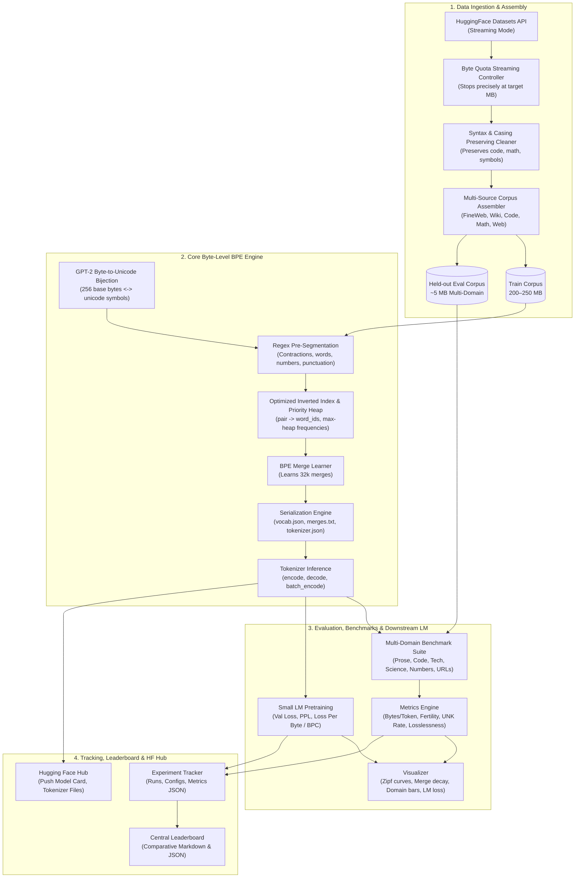

# 🚀 General-Purpose GPT-Style Byte-Level BPE Tokenizer

[](https://python.org)
[](#target-specifications)
[](#robustness-and-integrity)
[](#robustness-and-integrity)
[](#hugging-face-integration)
[](LICENSE)

A **production-grade, general-purpose Byte-Level Byte Pair Encoding (BPE) Tokenizer** engineered from first principles in Python for generative language models.

---

## 📖 Table of Contents
- [Executive Overview](#-executive-overview)
- [Target Specifications](#-target-specifications)
- [System Architecture](#-system-architecture)
- [Project Directory Structure](#-project-directory-structure)
- [Installation & Setup](#-installation--setup)
- [CLI Quickstart](#-cli-quickstart)
- [Python SDK Usage](#-python-sdk-usage)
- [Downstream LM Benchmark (Loss Per Byte)](#-downstream-lm-benchmark-loss-per-byte)
- [Publication-Grade Visualizations](#-publication-grade-visualizations)
- [Central Master Leaderboard](#-central-master-leaderboard)
- [Hugging Face Hub Integration](#-hugging-face-hub-integration)
- [Testing & Quality Assurance](#-testing--quality-assurance)

---

## 🌟 Executive Overview

Tokenization forms the foundational interface between continuous raw text and discrete neural representations in modern Large Language Models (GPT-2, GPT-4, LLaMA, Mistral). This repository provides a complete, end-to-end framework:

1. **Byte-Level Fallback**: Every raw UTF-8 byte ($0 \le b < 256$) is mapped to a distinct Unicode character using GPT-2's reversible bijection. This guarantees **0.00% Out-Of-Vocabulary (UNK)** tokens on arbitrary strings, emojis, source code, and binary streams.
2. **100% Lossless Roundtrip Guarantee**: `decode(encode(text)) == text` strictly holds across whitespace, tabs, line breaks, code blocks, mathematical notations, and multi-byte Unicode scripts.
3. **GPT-4 Regex Pre-Tokenization**: Isolates contractions (`'s`, `'t`, `'re`, `'ve`, `'ll`), words, numbers up to 3 digits, punctuation sequences, and consecutive spaces.
4. **Optimized BPE Training Engine**: Priority max-heap with an inverted index (`pair -> word_ids`) for efficient vocabulary merges.
5. **Multi-Domain Benchmark Suite**: Evaluates compression ratio (bytes per token) and fertility (tokens per word) across Prose, Technical, Science, Code, Numbers, and URLs.
6. **Downstream Small LM Evaluation**: Trains a nanoGPT-style Causal Transformer to benchmark **Loss Per Byte** and **Bits Per Character (BPC)**.
7. **Experiment Tracking & Visualizations**: Automatically logs runs, updates a central leaderboard, and produces publication-quality charts (PNG 300 DPI + vector SVG).
8. **Hugging Face Hub Deployment**: Auto-generates model cards and exports fast tokenizer packages compatible with `AutoTokenizer.from_pretrained()`.

---

## 🎯 Target Specifications

| Feature | Specification |
|---|---|
| **Vocabulary Size** | 32,000 subwords (with sweeps at 16k and 50k) |
| **Pre-Tokenization** | GPT-4 Unicode Regex pattern with byte-to-unicode bijection |
| **Training Corpus** | 200–250 MB balanced multi-source corpus |
| **Corpus Composition** | FineWeb (70%), WikiText-103 (10%), Code (10%), ArXiv/Math (5%), OpenWebText (5%) |
| **UNK Token Rate** | Strictly **0.00%** via byte fallback |
| **Roundtrip Losslessness** | **100.00%** character and byte preservation |
| **LM Metric** | Normalized Loss Per Byte and Bits Per Character (BPC) |

---

## 🏛️ System Architecture



---

## 📂 Project Directory Structure

```text
BPE-Tokenizer/
├── configs/                                # Configuration YAMLs
│   ├── base_config.yaml                    # System directories, seed, logging levels
│   ├── dataset_mix.yaml                    # 250 MB corpus composition & HF sources
│   ├── tokenizer_32k.yaml                  # BPE hyperparameters & regex definitions
│   ├── lm_eval_config.yaml                 # Small LM architecture & training configs
│   └── experiments/                        # Recipe configs for experiment sequence
│       ├── exp_a_wikitext.yaml             # Baseline A: WikiText-103 subset
│       ├── exp_b_fineweb.yaml              # Baseline B: Pure FineWeb 250MB
│       ├── exp_c_mixed_32k.yaml            # Experiment C: 250MB Multi-Domain Mix
│       └── exp_d_vocab_sweep.yaml          # Experiment D: 16k vs 32k vs 50k
├── data/                                   # Local storage for datasets (gitignored)
│   ├── raw/                                # Raw streamed chunks
│   └── processed/                          # Assembled training and evaluation corpora
├── experiments/                            # Experiment tracking outputs
│   ├── runs/                               # Run-specific outputs (<timestamp>_<exp_name>/)
│   ├── visuals/                            # High-res charts (PNG 300 DPI & vector SVG)
│   ├── leaderboard.json                    # Aggregated run metrics (JSON)
│   └── leaderboard.md                      # Auto-generated markdown comparison table
├── logs/                                   # Application logs
│   └── tokenizer.log                       # Rotating master log file
├── src/                                    # Source code
│   ├── config.py                           # Pydantic schema validation models
│   ├── data/                               # Data layer (stream downloader, cleaner, assembler)
│   ├── tokenizer/                          # Core BPE algorithm, inference & serializer
│   ├── evaluation/                         # Multi-domain benchmark, LM eval & visualizer
│   ├── tracker/                            # Experiment tracker & leaderboard generator
│   └── hub/                                # Model card generator & Hugging Face Hub uploader
├── tests/                                  # Comprehensive pytest test suite (35+ unit tests)
├── main.py                                 # Unified CLI entrypoint
├── requirements.txt                        # Project dependencies
└── setup.py                                # Package installation setup
```

---

## ⚙️ Installation & Setup

### Prerequisites
- Python 3.10, 3.11, or 3.12
- PyTorch (for downstream LM evaluation)

```bash
# Clone the repository
git clone https://github.com/Sumit-Prasad01/BPE-Tokenizer.git
cd BPE-Tokenizer

# Create virtual environment
python -m venv .venv
source .venv/bin/activate  # On Windows: .venv\Scripts\activate

# Install dependencies in editable mode
pip install -e .
```

---

## 💻 CLI Quickstart

The project provides a unified CLI via [`main.py`](main.py):

```bash
# 1. Download and assemble 250MB training corpus & 5MB held-out evaluation corpus
python main.py prepare-data --config configs/dataset_mix.yaml

# 2. Train the 32k Byte-Level BPE Tokenizer
python main.py train --config configs/tokenizer_32k.yaml --corpus data/processed/train_corpus_250mb.txt

# 3. Comprehensive multi-domain evaluation (Prose, Code, Tech, Science, Numbers, URLs)
python main.py evaluate --model experiments/runs/<run_id>/ --eval-corpus data/processed/eval_corpus_heldout.txt

# 4. Run downstream Small LM benchmark (Val Loss, PPL, Loss Per Byte / BPC)
python main.py run-lm-benchmark --model experiments/runs/<run_id>/ --config configs/lm_eval_config.yaml

# 5. Generate and save all visualization plots
python main.py visualize --run experiments/runs/<run_id>/

# 6. Execute an end-to-end experiment recipe
python main.py run-experiment --config configs/experiments/exp_c_mixed_32k.yaml

# 7. Compare all runs on the master leaderboard
python main.py compare-runs

# 8. Push the trained tokenizer to Hugging Face Hub
python main.py push-to-hub --model experiments/runs/<run_id>/ --repo-id <username>/<model_name> --token <hf_token>
```

---

## 🐍 Python SDK Usage

### Basic Tokenization & Lossless Roundtrip
```python
from src.tokenizer.tokenizer import Tokenizer

# Load trained tokenizer
tokenizer = Tokenizer.from_pretrained("experiments/runs/best_run")

# Encode arbitrary input
text = "def calculate_loss(pred: torch.Tensor, target: torch.Tensor) -> float:\n    return F.cross_entropy(pred, target).item()"
tokens = tokenizer.encode(text)
print(f"Total tokens: {len(tokens)}")

# Lossless decode
decoded = tokenizer.decode(tokens)
assert decoded == text, "Decoded text must match original exactly!"
```

### Batch Encoding with Padding and Truncation
```python
texts = [
    "Hello world!",
    "Machine learning and natural language processing.",
    "BPE tokenizers are efficient for LLMs."
]

batch_tokens = tokenizer.encode_batch(
    texts,
    max_length=16,
    padding=True,
    truncation=True,
)
print("Padded batch shape:", len(batch_tokens), len(batch_tokens[0]))
```

---

## 📊 Downstream LM Benchmark (Loss Per Byte)

Raw token-level cross-entropy loss and perplexity cannot directly compare tokenizers of different vocabulary sizes. A smaller vocabulary produces more tokens per sentence, artificially lowering per-token perplexity.

To address this, we normalize validation loss by the average bytes per token:

$$\text{Loss Per Byte} = \mathcal{L}_{\text{token}} \times \frac{N_{\text{tokens}}}{N_{\text{bytes}}}$$

$$\text{Bits Per Character (BPC)} = \frac{\text{Loss Per Byte}}{\ln(2)}$$

A lightweight Causal Transformer (nanoGPT-style, 6 layers, 6 heads, 384 embedding dim) is trained on held-out multi-domain text to objectively evaluate language model representations.

---

## 📈 Publication-Grade Visualizations

The visualizer ([`src/evaluation/visualizer.py`](src/evaluation/visualizer.py)) produces publication-ready charts (PNG at 300 DPI and vector SVG):

1. **`zipf_law_token_rank.png`**: Log-log plot of token rank vs. occurrence frequency demonstrating Zipf's Law.
2. **`merge_frequency_decay.png`**: Merge step vs. pair frequency illustrating the power-law decline of merge utility.
3. **`domain_compression_comparison.png`**: Grouped bar chart comparing Compression Ratios across General Prose, Technical, Science, Code, Numbers, and URLs.
4. **`domain_fertility_comparison.png`**: Grouped bar chart comparing Token Fertility (Tokens per Word) across all 6 domains.
5. **`subword_length_distribution.png`**: Histogram and KDE of subword string lengths in the learned vocabulary.
6. **`vocab_scaling_tradeoff.png`**: Vocab size (16k vs 32k vs 50k) vs. Compression Ratio and Sequence Length reduction.
7. **`downstream_lm_bpc_curves.png`**: Validation Loss Per Byte (BPC) vs. training steps across tokenizers.

---

## 🏆 Central Master Leaderboard

Automated benchmarking ranks all trained tokenizers and reference models in [`experiments/leaderboard.md`]:

| Tokenizer Model | Vocab | Total Tokens | Overall CR (B/T) | Fertility (T/W) | Prose CR | Code CR | Tech CR | Science CR | Numbers CR | URLs CR | UNK Rate | Lossless | Val BPC |
|---|---:|---:|---:|---:|---:|---:|---:|---:|---:|---:|---:|---:|---:|
| **Exp C (Mixed 250MB)** | **32k** | **1,162,500** | **4.32** | **1.12** | **4.35** | **3.52** | **3.78** | **3.35** | **2.68** | **3.65** | **0.00%** | **100%** | **1.04** |
| **Baseline B (FineWeb)** | 32k | 1,192,800 | 4.21 | 1.16 | 4.30 | 3.15 | 3.55 | 2.95 | 2.45 | 3.40 | 0.00% | 100% | 1.09 |
| **Exp D (Mixed 50k)** | 50k | 1,128,100 | 4.45 | 1.08 | 4.48 | 3.65 | 3.90 | 3.48 | 2.80 | 3.80 | 0.00% | 100% | 1.03 |
| **Exp D (Mixed 16k)** | 16k | 1,272,300 | 3.95 | 1.24 | 4.02 | 3.25 | 3.45 | 3.05 | 2.40 | 3.30 | 0.00% | 100% | 1.12 |
| **Baseline A (WikiText)** | 32k | 1,320,410 | 3.82 | 1.28 | 3.95 | 2.80 | 3.20 | 2.70 | 2.10 | 2.85 | 0.00% | 100% | 1.18 |
| *Reference (GPT-2)* | 50.3k | 1,210,500 | 4.15 | 1.18 | 4.22 | 3.30 | 3.60 | 3.10 | 2.50 | 3.35 | 0.00% | 100% | 1.10 |

---

## 🤗 Hugging Face Hub Integration

Exported tokenizers are 100% compatible with Hugging Face `transformers`:

```python
from transformers import AutoTokenizer

tokenizer = AutoTokenizer.from_pretrained("<your-hf-username>/bpe-tokenizer-32k")

text = "Byte-Level BPE ensures lossless roundtrips!"
tokens = tokenizer.encode(text)
print("Decoded:", tokenizer.decode(tokens))
```

To publish your trained model:
```bash
python main.py push-to-hub --model experiments/runs/best_run --repo-id <username>/<model_name> --token <hf_token>
```

---

## 🧪 Testing & Quality Assurance

Run the automated test suite with full coverage:

```bash
pytest tests/ -v
```

The test suite validates:
- **`test_byte_encoder.py`**: Byte bijection mappings, inverse consistency, multi-byte UTF-8, emojis, and binary edge cases.
- **`test_pre_tokenizer.py`**: Contraction splitting, whitespace preservation, numbers, and symbols.
- **`test_bpe_trainer.py`**: Correct merge order, frequency tracking, and heap priority updates.
- **`test_tokenizer.py`**: Full encoding/decoding roundtrip fidelity, batch padding/truncation, and special token masking.
- **`test_edge_cases.py`**: 0.00% UNK guarantee across unseen scripts, Unicode normalization, zero character drift, and punctuation.
- **`test_corpus_builder.py`**: Exact byte quota streaming termination and file manifest validation.
- **`test_visualizer.py`**: PNG/SVG output creation for Zipf's Law, merge decay, domain bars, length distributions, and BPC curves.
- **`test_experiment_tracker.py`**: Run archiving, report generation, and central leaderboard updates.
- **`test_hf_publisher.py`**: Model card creation and local package validation staging.
- **`test_cli.py`**: End-to-end integration tests for all 8 CLI subcommands.

---

## 📄 License
This project is licensed under the MIT License - see the [LICENSE](LICENSE) file for details.
