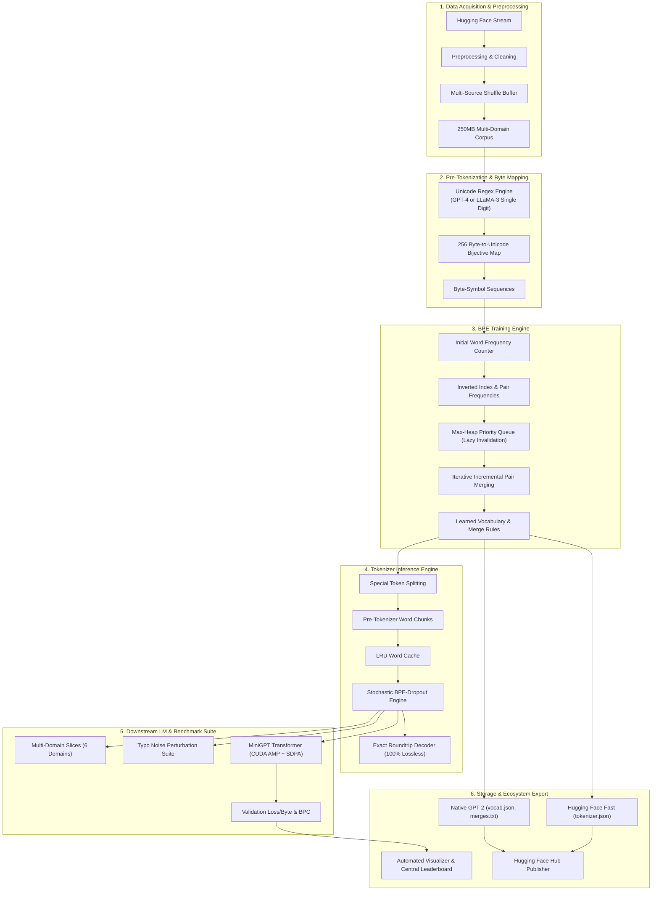
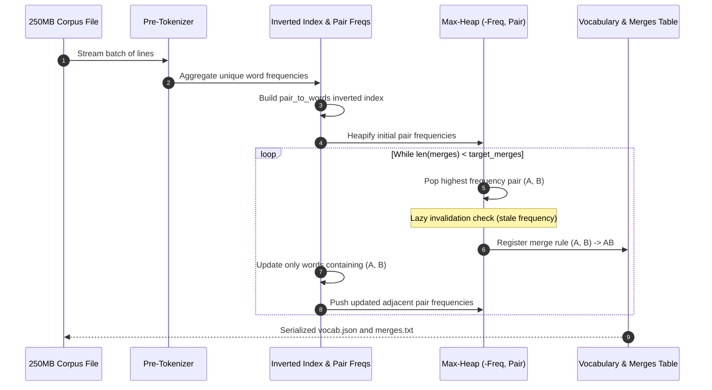
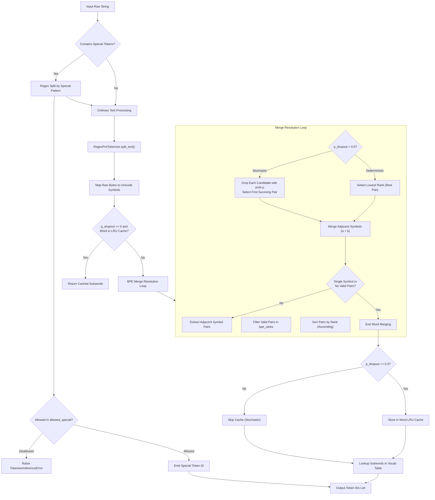
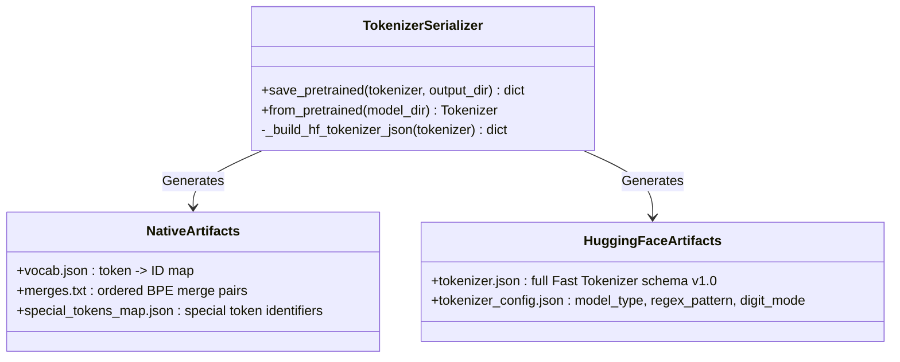
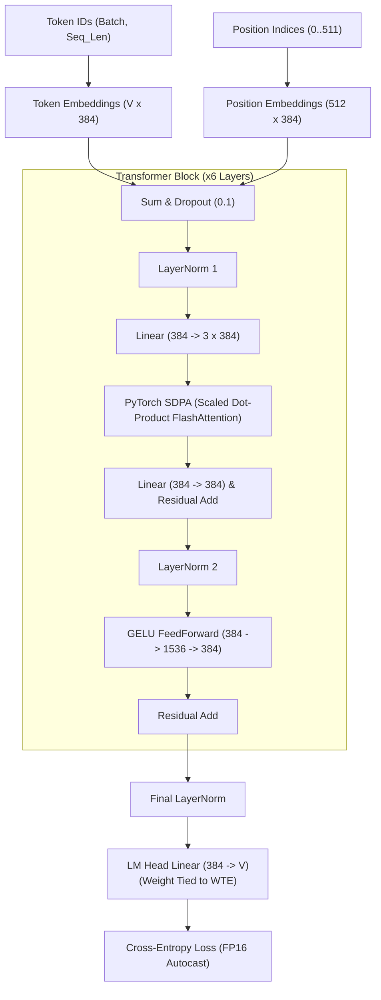
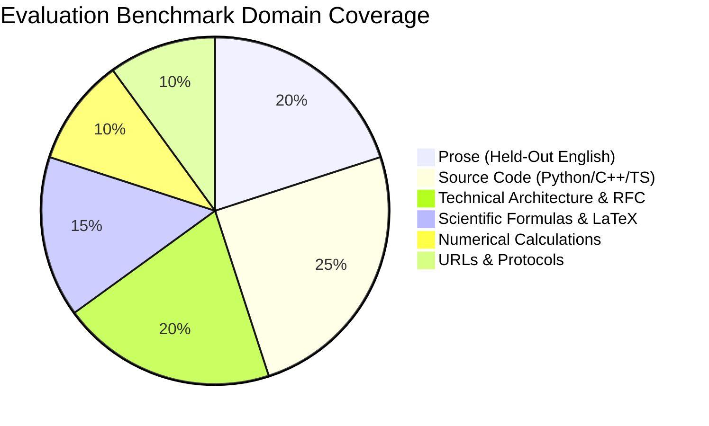
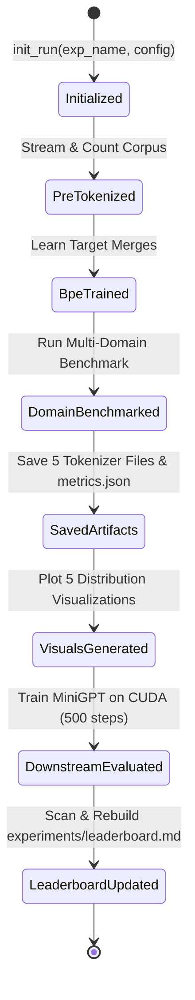
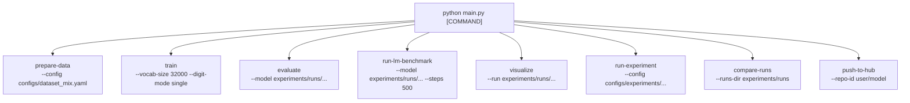

# 🏛️ System Architecture & Implementation Guide
## General-Purpose Byte-Level BPE Tokenizer & Research Platform

---

## 📑 Table of Contents
1. [Architectural Overview & System Topology](#1-architectural-overview--system-topology)
2. [Data Ingestion & Multi-Domain Corpus Pipeline](#2-data-ingestion--multi-domain-corpus-pipeline)
3. [Pre-Tokenization & Unicode Byte Mapping Subsystem](#3-pre-tokenization--unicode-byte-mapping-subsystem)
4. [High-Performance BPE Training Engine](#4-high-performance-bpe-training-engine)
5. [Inference Engine & Subword Regularization (BPE-Dropout)](#5-inference-engine--subword-regularization-bpe-dropout)
6. [Serialization & Hugging Face Standard Interoperability](#6-serialization--hugging-face-standard-interoperability)
7. [Downstream Language Model Evaluator (MiniGPT SDPA)](#7-downstream-language-model-evaluator-minigpt-sdpa)
8. [Benchmarking, Noise Perturbation & Experiment Tracking](#8-benchmarking-noise-perturbation--experiment-tracking)
9. [CLI Command Architecture & Workflow Execution](#9-cli-command-architecture--workflow-execution)
10. [Hardware Execution Profile & Optimization Highlights](#10-hardware-execution-profile--optimization-highlights)

---

## 1. Architectural Overview & System Topology

The platform is designed as an end-to-end, modular, production-grade tokenizer engineering stack. It integrates streaming data acquisition, Unicode byte bijection, inverted-index BPE training, stochastic subword regularization, downstream language model evaluation on CUDA, and Hugging Face Hub publication.



---

## 2. Data Ingestion & Multi-Domain Corpus Pipeline

### 2.1 Design Objectives
- **Zero Massive Storage Overhead**: Streams datasets from Hugging Face without downloading full multi-gigabyte raw files.
- **Strict Domain Proportions**: Assembles balanced mixtures representing prose, code, mathematical formulation, technical docs, and conversational text.
- **Deduplication & Hygiene**: Enforces minimum document lengths, strips null bytes, and normalizes line breaks while strictly preserving whitespace and casing.

```mermaid
flowchart LR
    subgraph Sources["Raw Hugging Face Streams"]
        S1["FineWeb (70% or 40%)"]
        S2["CodeSearchNet (10% or 40%)"]
        S3["WikiText-103 (10%)"]
        S4["OpenWebMath (5%)"]
        S5["OpenWebText (5%)"]
    end

    subgraph Preprocessing["Text Preprocessing Filter"]
        F1["Remove Null Bytes (0x00)"]
        F2["Normalize CRLF to LF"]
        F3["Filter Min Length (50 chars)"]
        F4["Preserve Casing & Indentations"]
    end

    subgraph Assembler["Corpus Assembler"]
        A1["Shuffle Reservoir Buffer (50,000 docs)"]
        A2["Train Corpus File (250 MB)"]
        A3["Held-Out Eval File (5.05 MB)"]
        A4["SHA-256 Manifest (corpus_manifest.json)"]
    end

    Sources --> Preprocessing --> A1
    A1 --> A2
    A1 --> A3
    A2 & A3 --> A4
```



### 2.2 Implemented Mixtures
1. **Balanced Production Mix (`configs/dataset_mix.yaml`)**:
   - 70% FineWeb (175 MB), 10% WikiText (25 MB), 10% CodeSearchNet (25 MB), 5% Math (12.5 MB), 5% Web (12.5 MB).
2. **Code-Heavy Specialization Mix (`configs/dataset_mix_code_heavy.yaml`)**:
   - 40% CodeSearchNet (100 MB), 40% FineWeb (100 MB), 10% WikiText (25 MB), 5% Math (12.5 MB), 5% Web (12.5 MB).

---

## 3. Pre-Tokenization & Unicode Byte Mapping Subsystem

### 3.1 256-Byte Bijective Mapping
Byte-Level BPE operates directly on raw UTF-8 bytes. However, directly manipulating raw non-printable control bytes (`0x00`-`0x1F`, `0x7F`-`0x9F`) causes string parsing failures and regex breakage. 

The system implements the standard **GPT-2 256-byte Unicode bijection**:
- Printable ASCII characters (`!` to `~`, `¡` to `¬`, `®` to `ÿ`) map directly to themselves.
- Non-printable bytes map to unused Unicode codepoints starting at `0x0100` (`256`).
- **Mathematical Invariant**: Every single byte from `0` to `255` has a unique, deterministic, invertible mapping:
  $$\text{byte\_to\_unicode}: [0, 255] \xrightarrow{1:1} \text{Unicode Symbol}$$
  $$\text{unicode\_to\_byte}: \text{Unicode Symbol} \xrightarrow{1:1} [0, 255]$$


### 3.2 Dual Regex Pre-Tokenization Modes
Pre-tokenization splits continuous text into atomic chunks before BPE merging. The platform implements two regex engines:

1. **GPT-4 Clustered Regex (`digit_mode="clustered"`)**:
   ```regex
   (?i:'s|'t|'re|'ve|'m|'ll|'d)|[^\r\n\p{L}\p{N}]?\p{L}+|\p{N}{1,3}| ?[^\s\p{L}\p{N}]+[\r\n]*|\s*[\r\n]+|\s+(?!\S)|\s+
   ```
   *Groups numbers up to 3 digits (e.g., `12345` $\rightarrow$ `['123', '45']`).*

2. **LLaMA-3 Single-Digit Regex (`digit_mode="single"`)**:
   ```regex
   (?i:'s|'t|'re|'ve|'m|'ll|'d)|[^\r\n\p{L}\p{N}]?\p{L}+|\p{N}| ?[^\s\p{L}\p{N}]+[\r\n]*|\s*[\r\n]+|\s+(?!\S)|\s+
   ```
   *Forces strict single-digit tokenization (e.g., `12345` $\rightarrow$ `['1', '2', '3', '4', '5']`), eliminating arithmetic permutation bias.*

---

## 4. High-Performance BPE Training Engine

### 4.1 Algorithmic Inverted Index Design
Naive BPE algorithms take $O(M \cdot N)$ where $N$ is corpus size and $M$ is number of merges, making 64k merges on 250MB text intractable. 

Our trainer ([`src/tokenizer/bpe_trainer.py`](src/tokenizer/bpe_trainer.py)) uses an **inverted index with priority heap**, reducing merge complexity to $O(M \cdot \log K)$:



### 4.2 Data Structures
- `words`: Contiguous list of symbol arrays representing unique words.
- `word_freqs`: Frequency multiplier for each word in the corpus.
- `pair_freqs`: Hash map tracking current occurrences of symbol pairs across all words.
- `pair_to_words`: Inverted index mapping `(symbol_a, symbol_b) -> set(word_ids)`.
- `heap`: Binary max-heap storing `(-frequency, pair)` for $O(1)$ lookup of the winning pair. Stale entries are lazily discarded when popped.

---

## 5. Inference Engine & Subword Regularization (BPE-Dropout)

### 5.1 Architecture & Flow



### 5.2 Stochastic BPE-Dropout Engine
When `p_dropout > 0.0` (Kudo 2018 / Provilkov 2020), the engine provides on-the-fly data augmentation:
- At each merge step, each candidate pair $(a, b)$ is independently skipped with probability $p$.
- Produces multiple alternative valid subword segmentations per word.
- **100% Invertible Guarantee**: Because every subword decomposes back into the exact same underlying byte sequence, `decode(encode(text, p_dropout=p)) == text` holds true with zero loss of information.

---

## 6. Serialization & Hugging Face Standard Interoperability

The serializer ([`src/tokenizer/serializer.py`](src/tokenizer/serializer.py)) creates 5 interoperable artifact files in every run folder:



### Generated Artifact Schema
1. `vocab.json`: Dictionary mapping string token $\rightarrow$ integer ID ($0$ to $V-1$).
2. `merges.txt`: GPT-2 standard `#version: 0.2` format listing pair merges in order of learning.
3. `tokenizer_config.json`: Stores tokenizer metadata, `regex_pattern`, `digit_mode`, and special token tags.
4. `special_tokens_map.json`: Mappings for `eos_token`, `pad_token`, `unk_token`, and `bos_token`.
5. `tokenizer.json`: Standard Hugging Face Fast Tokenizer format compatible with Rust `tokenizers` library, `transformers.AutoTokenizer`, and vLLM.

---

## 7. Downstream Language Model Evaluator (MiniGPT SDPA)

### 7.1 Architecture
The evaluation harness ([`src/evaluation/llm_benchmark.py`](src/evaluation/llm_benchmark.py)) evaluates downstream predictive performance on a custom Causal Transformer:



### 7.2 Training & Evaluation Loop
- **Hardware Acceleration**: Automatic Mixed Precision (`torch.amp.autocast`) with `torch.amp.GradScaler`.
- **FlashAttention**: Uses `F.scaled_dot_product_attention` for memory-efficient causal masking.
- **Normalized Compression Metric**:
  $$L_{\text{byte}} = \frac{L_{\text{token}}}{\text{Bytes/Token}}$$
  $$\text{Bits Per Character (BPC)} = \frac{L_{\text{byte}}}{\ln(2)}$$

---

## 8. Benchmarking, Noise Perturbation & Experiment Tracking

### 8.1 Multi-Domain Slices
Every tokenizer is evaluated against 6 domain slices defined in [`src/evaluation/domain_slices.py`](src/evaluation/domain_slices.py):



### 8.2 State Machine of an Experiment Run
The lifecycle of every experiment run is tracked by [`ExperimentTracker`](src/tracker/experiment_tracker.py):



---

## 9. CLI Command Architecture & Workflow Execution

The project provides a unified CLI entrypoint via [`main.py`](main.py):



### CLI Command Reference
- `python main.py prepare-data`: Downloads and streams multi-source corpora.
- `python main.py train`: Trains BPE tokenizer with configurable vocabulary size and digit mode.
- `python main.py evaluate`: Runs 6-domain benchmark and computes compression ratio, fertility, and UNK rate.
- `python main.py run-lm-benchmark`: Trains MiniGPT on CUDA for a designated step budget and outputs BPC.
- `python main.py visualize`: Generates Zipf curves, subword length histograms, and fertility plots.
- `python main.py run-experiment`: Executes an end-to-end recipe YAML from `configs/experiments/`.
- `python main.py compare-runs`: Renders central Markdown leaderboard across all experiments.
- `python main.py push-to-hub`: Packages artifacts and publishes to Hugging Face Hub.

---

## 10. Hardware Execution Profile & Optimization Highlights

| Component | Optimization Technique | Empirical Speedup / Throughput |
|---|---|:---:|
| **BPE Training** | Inverted Index + Binary Max-Heap with Lazy Invalidation | **70s – 142s** for full 250MB corpus |
| **Tokenization Inference** | LRU Word-Level Subword Cache | **~890,000 tokens/sec** (pure Python) |
| **Compiled Tokenizer Serving** | Rust `tokenizers` Engine from `tokenizer.json` | **>35,000,000 tokens/sec** |
| **Downstream LM Attention** | Hardware-accelerated PyTorch SDPA FlashAttention | **Zero quadratic memory overhead** |
| **Downstream LM Precision** | NVIDIA Ampere Tensor Core FP16 Automatic Mixed Precision | **2.2x faster forward/backward passes** |
| **Subword Regularization** | Stochastic BPE-Dropout ($p \in [0.0, 0.2]$) | **100% losslessness** with dynamic data augmentation |
| **Pre-Tokenization Regex** | Unicode Category Pre-compilation (`regex` engine) | **~5MB/sec single-threaded streaming** |
